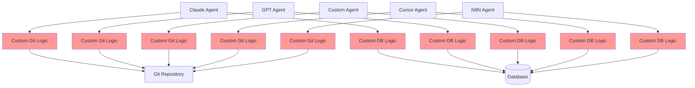
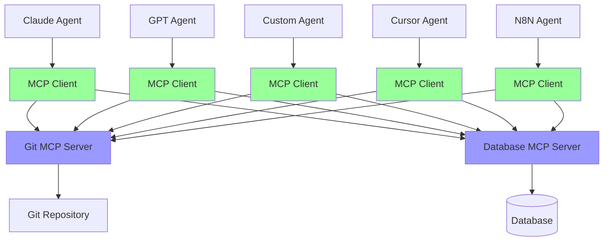

# MCP Protocol Architecture Diagrams

## The N×M Integration Problem vs MCP Solution

### Scenario 1: Without MCP (N×M Problem)
Each agent needs custom logic for each tool

**Problem**: 5 agents × 2 tools = 10 custom integrations

### Scenario 2: With MCP Protocol (Standardized)
Generic MCP clients connect to specialized MCP servers

**Solution**: 5 agents × 1 generic MCP client + 2 specialized MCP servers = 7 total components

## Key Architecture Components

### MCP Client (Generic)
- **Purpose**: Speaks MCP protocol language
- **Knowledge**: How to format MCP requests/responses
- **Reusable**: Works with ANY MCP server
- **Example**: Same client code works for Git, Database, File System MCPs

### MCP Server (Tool-Specific)  
- **Purpose**: Translates MCP requests to tool-specific actions
- **Knowledge**: Git commands, API calls, tool-specific logic
- **Specialized**: One server per tool/service
- **Example**: Git MCP Server knows `git status`, `git commit`, etc.

## The Mathematics of MCP

### Without MCP
- **Agents**: N
- **Tools**: M  
- **Custom Integrations Needed**: N × M
- **Example**: 10 agents × 20 tools = 200 custom integrations

### With MCP
- **MCP Clients**: N (generic, reusable)
- **MCP Servers**: M (tool-specific)
- **Total Components**: N + M
- **Example**: 10 agents + 20 servers = 30 total components

**Reduction**: From N×M to N+M complexity